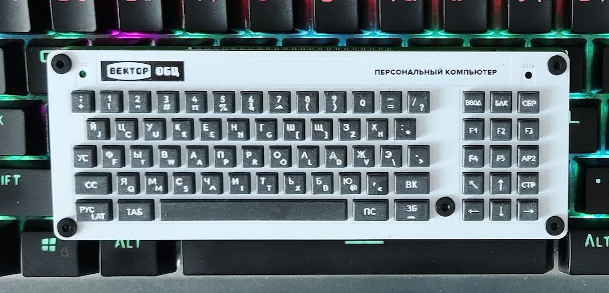

# A miniature keyboard for Vector-06c

The keyboard is a miniature full-functioning replica of Vector-06c keyboard. Its dimensions are 150x55mm. 
It can be connected as a replacement keyboard to the real Vector-06c, or it can be used as a USB HID keyboard with a Vector-06c emulator or FPGA implementation.
It can also be connected to v06c-esp vector-06c-mini.

The design files comprise 3 parts. 

 1. [Key caps](blender) A high resolution mesh with legend engraving designed in blender
 2. [Bottom PCB](kicad/v06ckeyboard) carries the switches and an optional Pi Pico for connectivity
 3. [Top PCB](kicad/v06ckeyboard) a frame that holds the keycaps in place

This keyboard is very small indeed.

## Firmware

### spislave

[spislave](firmware/spislave) is the main intended use with [v06x-mini](https://github.com/svofski/v06x-tiny).

